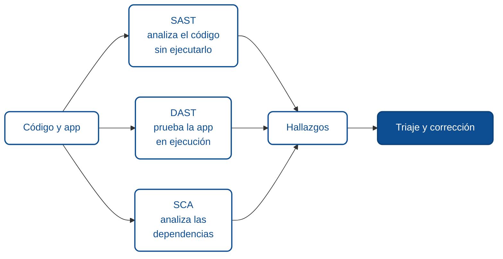

# Metodología para encontrar vulnerabilidades

Encontrar vulnerabilidades no es adivinar ni probar cosas al azar. Es un proceso ordenado: entender qué expone la aplicación, revisar cada punto de entrada con una pregunta concreta, y combinar herramientas automáticas con revisión humana. Este módulo te da ese método y el marco legal para aplicarlo.

:::warning Alcance y autorización
Todo lo que sigue aplica a **sistemas propios o con permiso explícito por escrito**. Ejecutar pruebas contra sistemas ajenos sin autorización es un delito, aunque no causes daño. Antes de probar, define el alcance: qué sistemas, qué técnicas, en qué horario, y con qué contacto ante un incidente.
:::

## La mentalidad: dejar de confiar en el cliente

El punto de partida de toda la seguridad web es un cambio de suposición. Como desarrollador, asumes que la gente usa la aplicación como la diseñaste. Quien busca vulnerabilidades asume lo contrario: que cada dato que entra puede venir manipulado, en un formato inesperado, con intención de romper algo.

El navegador, la URL, los formularios, las cabeceras, las cookies y el cuerpo de cada request son entradas que el usuario controla por completo. La validación que hiciste en el frontend no cuenta como defensa: un atacante le pega directo a la API sin pasar por tu JavaScript. **Toda validación real ocurre en el servidor.**

## La superficie de ataque

La superficie de ataque es el conjunto de puntos por donde entra información al sistema. Mapearla es el primer paso concreto. En una aplicación web típica incluye:

- Cada endpoint de la API, con sus parámetros de ruta, query string y cuerpo.
- Formularios y campos de entrada de la interfaz.
- Cabeceras HTTP (incluidas `Authorization`, `Cookie`, `Content-Type`, `User-Agent`).
- Parámetros ocultos, campos deshabilitados en el frontend, y endpoints no documentados.
- Archivos que el usuario sube.
- Integraciones con terceros y webhooks entrantes.

Cuanto mejor entiendas por dónde entran datos, más sistemática será la búsqueda. Un endpoint que nadie mapeó es un endpoint que nadie revisó.

## Tres tipos de análisis, complementarios

No hay una sola herramienta que encuentre todo. Las prácticas maduras combinan tres miradas, que ya conociste en los [fundamentos de SonarQube](../fundamentos-sonarqube/index.md):

- **SAST** (*Static Application Security Testing*) lee el código fuente y busca patrones de riesgo sin ejecutarlo. Encuentra, por ejemplo, una consulta SQL construida por concatenación. Es lo que hace SonarQube.
- **DAST** (*Dynamic Application Security Testing*) prueba la aplicación ya corriendo, enviándole requests como lo haría un atacante y observando las respuestas. Encuentra fallas que solo se ven en ejecución.
- **SCA** (*Software Composition Analysis*) revisa las dependencias de terceros contra bases de vulnerabilidades conocidas.

Las tres se complementan con la **revisión manual**, que sigue siendo insustituible para la lógica de negocio: ninguna herramienta automática entiende que un usuario no debería poder ver la factura de otro.

## Herramientas del oficio

Para empezar, no necesitas un arsenal. Estas cubren la mayoría de los casos:

- **Las DevTools del navegador.** La pestaña de red muestra cada request real que hace la app, con sus cabeceras y cuerpo. Es la forma más directa de ver qué manda tu frontend y de repetir un request modificándolo.
- **Un proxy de interceptación** como [OWASP ZAP](https://www.zaproxy.org/) (gratuito y open source) o Burp Suite. Se sienta entre el navegador y el servidor, y te deja ver, modificar y repetir cualquier request. Es la herramienta central del análisis manual.
- **`curl`** para reproducir y automatizar requests desde la terminal, sin pasar por el navegador.
- **Escáneres SAST/SCA** integrados al pipeline (SonarQube, y para dependencias `dotnet list package --vulnerable`, `npm audit`).

## El método, paso a paso

Un recorrido de revisión ordenado se parece a esto:

1. **Mapear la superficie.** Lista los endpoints y las entradas. Navega la aplicación con el proxy activo para capturar los requests reales, incluidos los que el frontend hace en segundo plano.
2. **Elegir una categoría por vez.** No revises "todo a la vez". Toma una categoría (inyección, control de acceso, XSS) y recórrela en cada entrada. Los módulos siguientes son justamente esa lista.
3. **Formular una hipótesis por entrada.** "¿Qué pasa si este campo `id` lo cambio por el de otro usuario?" "¿Qué pasa si en este texto meto una comilla?" Cada categoría trae su pregunta.
4. **Probar con la mínima prueba de concepto.** Una comilla que rompe un query, un `id` ajeno que devuelve datos. No hace falta un exploit completo para confirmar que la vulnerabilidad existe.
5. **Documentar el hallazgo.** Qué endpoint, qué entrada, qué prueba lo dispara, y qué se obtuvo. Sin evidencia reproducible, un hallazgo no se puede corregir ni verificar.
6. **Correr los escáneres en paralelo.** SAST y SCA en el pipeline atrapan lo repetitivo mientras tú te concentras en la lógica.

## Qué peligro implica no tener método

Sin un proceso, la revisión de seguridad se vuelve una sensación ("me parece que está bien") en lugar de una verificación. Los puntos ciegos quedan sin mirar, los hallazgos se pierden sin documentar, y el equipo no puede saber qué se revisó y qué no. El método convierte la seguridad en algo repetible y auditable, no en un acto de fe.

## Resumen para agentes

- **Objetivo:** encontrar vulnerabilidades de forma sistemática y dentro de un alcance autorizado.
- **Entradas comunes:** mapa de endpoints y entradas, acceso al código, un proxy de interceptación, escáneres SAST/SCA.
- **Controles clave:** mapeo de superficie, revisión por categoría, hipótesis por entrada, prueba de concepto mínima, documentación reproducible.
- **Salidas esperadas:** lista de hallazgos con evidencia, endpoint, entrada y severidad preliminar.
- **Errores frecuentes:** probar sin autorización, confiar solo en herramientas automáticas, revisar sin documentar, tratar la validación de frontend como defensa.

## Glosario

**Superficie de ataque** *(Attack surface)* — conjunto de puntos por donde entra información al sistema y que un atacante puede intentar aprovechar.

**SAST** *(Static Application Security Testing)* — análisis del código fuente sin ejecutarlo.

**DAST** *(Dynamic Application Security Testing)* — pruebas contra la aplicación en ejecución.

**SCA** *(Software Composition Analysis)* — análisis de dependencias de terceros contra vulnerabilidades conocidas.

**Proxy de interceptación** *(Intercepting proxy)* — herramienta que se ubica entre cliente y servidor para ver y modificar el tráfico.

**Prueba de concepto** *(Proof of concept, PoC)* — demostración mínima de que una vulnerabilidad existe, sin necesidad de un exploit completo.

**Alcance** *(Scope)* — definición acordada de qué sistemas y técnicas están autorizados en una evaluación.

:::info Referencias primarias
- [OWASP Top 10](https://owasp.org/Top10/) — los riesgos más críticos en aplicaciones web.
- [OWASP Web Security Testing Guide](https://owasp.org/www-project-web-security-testing-guide/) — metodología de pruebas.
- [OWASP ZAP](https://www.zaproxy.org/) — proxy de interceptación open source.
- [CWE Top 25](https://cwe.mitre.org/top25/) — debilidades de software más peligrosas.
:::

---

### Bloque estructurado para agentes

**Objetivo:** aplicar una metodología ordenada para encontrar vulnerabilidades en un sistema propio o autorizado.

**Entradas:**
- Alcance autorizado por escrito (sistemas, técnicas, ventana de tiempo).
- Mapa de endpoints y puntos de entrada.
- Acceso al código fuente y a la aplicación en ejecución.
- Proxy de interceptación y escáneres SAST/SCA.

**Pasos:**
1. Confirmar el alcance y la autorización antes de cualquier prueba.
2. Mapear la superficie de ataque capturando el tráfico real con un proxy.
3. Recorrer una categoría de vulnerabilidad por vez sobre cada entrada.
4. Formular una hipótesis por entrada y confirmarla con una prueba de concepto mínima.
5. Documentar cada hallazgo con endpoint, entrada, prueba y evidencia.
6. Ejecutar SAST y SCA en el pipeline en paralelo a la revisión manual.

**Salidas:**
- Inventario de hallazgos reproducibles con severidad preliminar.
- Mapa de superficie de ataque actualizado.

**Errores comunes:**
- Probar sin autorización explícita.
- Tratar la validación del frontend como control de seguridad.
- Depender solo de escáneres y omitir la lógica de negocio.
- No documentar, con lo que el hallazgo no se puede corregir ni verificar.

**Referencias cruzadas:**
- [1.3.5 SAST y SCA en la fase de validación](../fundamentos-sonarqube/05-sast-y-sca-en-validacion.md)
- [1.6.8 Del hallazgo a la corrección](./08-del-hallazgo-a-la-correccion.md)

---

<AuthorCredit />
