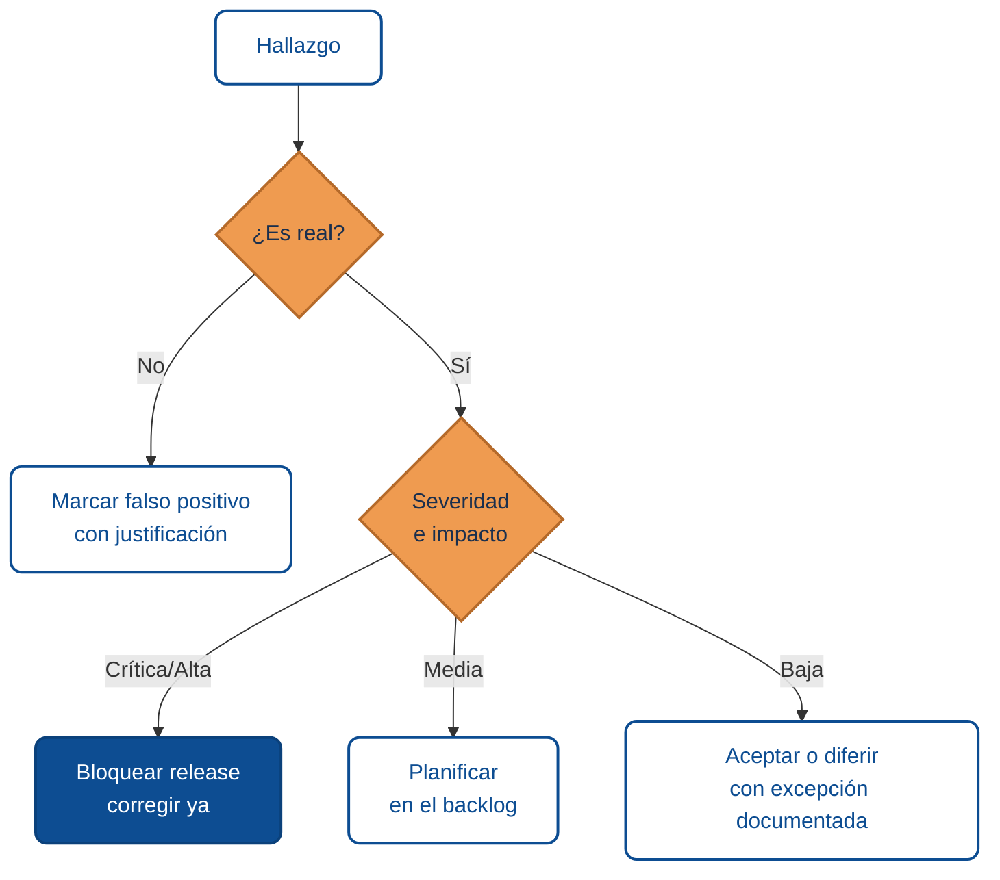
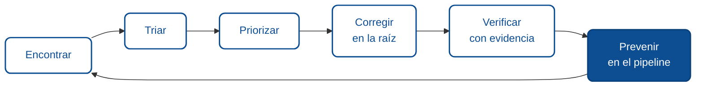

# Del hallazgo a la corrección

Encontrar una vulnerabilidad es la mitad del trabajo. La otra mitad es decidir qué tan grave es, en qué orden corregirla, cómo llevar el arreglo a producción, y cómo evitar que vuelva a aparecer. Este módulo cierra el ciclo: convierte una lista de hallazgos en un plan de corrección medible.

:::tip Archivo copiable
La skill [`revisar-hallazgo-sast`](https://github.com/10xGuatemala/bootcamp/tree/main/examples-md/agents/skills/general) automatiza el triaje de un hallazgo individual (SonarQube, CodeQL, Snyk, Dependabot): decide si es bloqueante, mitigable o falso positivo y propone un plan concreto. Cópiala a `.claude/skills/` cuando implementes el flujo de este módulo.
:::

## Paso 1: Triaje — ¿es real y qué tan grave?

No todo hallazgo es una vulnerabilidad, y no toda vulnerabilidad es urgente. El triaje decide tres cosas por cada uno:

- **¿Es real o es un falso positivo?** Las herramientas automáticas marcan patrones; a veces el patrón no es explotable en el contexto real. Confírmalo con una prueba de concepto o revisión.
- **¿Qué severidad tiene?** Combina el impacto (qué se compromete: datos de todos, de uno, disponibilidad) con la facilidad de explotación. El estándar de industria para puntuar esto es **CVSS**, que da un número de 0 a 10.
- **¿Es alcanzable?** Una vulnerabilidad en código muerto o detrás de una autenticación fuerte no tiene la misma urgencia que una en un endpoint público sin autenticar.

## Paso 2: Priorizar

Con la severidad clara, el orden de corrección casi se dibuja solo: **primero lo crítico y explotable en superficie expuesta.** Un IDOR en un endpoint público pesa más que un XSS en un panel interno detrás de doble autenticación, aunque ambos sean "altos" en abstracto. La priorización honesta combina severidad técnica con exposición real y valor del dato en juego.

## Paso 3: Corregir en la raíz

La corrección apunta a la causa, no al síntoma. Cada módulo de este curso dio la corrección de raíz de su categoría: parametrizar en lugar de escapar comillas, verificar propiedad en lugar de esconder el botón, hashear con algoritmo lento en lugar de ofuscar. Un parche que tapa el caso puntual pero deja el patrón vivo reaparece en el próximo endpoint.

## Paso 4: Verificar con evidencia

Una corrección no está hecha porque el código compila. Está hecha cuando la prueba de concepto que confirmaba la vulnerabilidad **ya no funciona**. Guarda esa evidencia: el request que antes devolvía datos ajenos y ahora devuelve 403, la entrada que antes ejecutaba un script y ahora se muestra como texto. Esa evidencia es lo que cierra el hallazgo de forma auditable.

## Paso 5: Prevenir la reaparición

El objetivo final no es corregir un hallazgo, es que esa clase de hallazgo no vuelva a pasar. Ahí entra el pipeline:

- **Quality gate** que bloquee el merge ante vulnerabilidades críticas nuevas, con SAST y SCA en cada pull request (ver [SAST y SCA en la validación](../fundamentos-sonarqube/05-sast-y-sca-en-validacion.md)).
- **Un test de regresión** que reproduzca la vulnerabilidad corregida, para que si alguien reintroduce el patrón, la prueba se ponga en rojo.
- **La corrección de raíz** aplicada como patrón del equipo, no como arreglo aislado.

## Checklist de cierre por hallazgo

- Confirmado como real (no falso positivo) con prueba de concepto.
- Severidad asignada (CVSS) y exposición evaluada.
- Priorizado respecto de los demás hallazgos.
- Corregido en la raíz, no solo el caso puntual.
- Verificado: la prueba de concepto ya no funciona.
- Test de regresión agregado.
- Quality gate del pipeline actualizado si aplica.
- Excepción documentada con dueño y fecha, si se difirió.

## Resumen para agentes

- **Objetivo:** convertir hallazgos en correcciones verificadas y prevenir su reaparición.
- **Entradas comunes:** lista de hallazgos con evidencia, salidas de SAST/SCA, pipeline de CI.
- **Controles clave:** triaje con CVSS, priorización por severidad y exposición, corrección de raíz, verificación con evidencia, quality gate, test de regresión.
- **Salidas esperadas:** hallazgos cerrados de forma auditable, pipeline que impide la reaparición.
- **Errores frecuentes:** corregir el síntoma y no la causa, cerrar sin verificar, dejar excepciones sin seguimiento, no automatizar la prevención.

## Glosario

**Triaje** *(Triage)* — evaluar cada hallazgo para decidir si es real, su severidad y su urgencia.

**Falso positivo** *(False positive)* — hallazgo marcado por una herramienta que no es explotable en el contexto real.

**CVSS** *(Common Vulnerability Scoring System)* — estándar para puntuar la severidad de una vulnerabilidad de 0 a 10.

**Quality gate** — criterio automático que bloquea el avance si no se cumplen umbrales de calidad y seguridad.

**Test de regresión** *(Regression test)* — prueba que reproduce un fallo corregido para detectar si reaparece.

**Excepción documentada** *(Documented exception)* — aceptación explícita y trazable de un riesgo que no se remedia de inmediato.

:::info Referencias primarias
- [CVSS](https://www.first.org/cvss/) — sistema de puntuación de severidad.
- [OWASP Top 10](https://owasp.org/Top10/) — marco de categorías.
- [CWE Top 25](https://cwe.mitre.org/top25/) — debilidades más críticas.
- [NIST SSDF](https://csrc.nist.gov/Projects/ssdf) — prácticas seguras en el ciclo de desarrollo.
:::

---

### Bloque estructurado para agentes

**Objetivo:** llevar cada hallazgo desde su detección hasta una corrección verificada y prevenida.

**Entradas:**
- Lista de hallazgos con evidencia reproducible.
- Salidas de SAST y SCA.
- Acceso al pipeline de CI y a su quality gate.

**Pasos:**
1. Triar cada hallazgo: real vs. falso positivo, severidad (CVSS), exposición.
2. Priorizar por severidad combinada con exposición real.
3. Corregir en la raíz según la categoría correspondiente.
4. Verificar que la prueba de concepto ya no funciona y guardar evidencia.
5. Agregar un test de regresión y actualizar el quality gate.
6. Documentar excepciones con dueño y fecha si se difiere.

**Salidas:**
- Hallazgos cerrados de forma auditable.
- Pipeline que bloquea la reintroducción del patrón.

**Errores comunes:**
- Corregir el síntoma y no la causa.
- Cerrar sin verificar con evidencia.
- No automatizar la prevención en el pipeline.

**Referencias cruzadas:**
- [1.6.1 Metodología para encontrar vulnerabilidades](./01-metodologia-para-encontrar-vulnerabilidades.md)
- [1.3.5 SAST y SCA en la fase de validación](../fundamentos-sonarqube/05-sast-y-sca-en-validacion.md)

---

<AuthorCredit />
