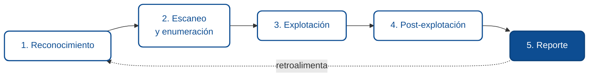

# Hacking ético: práctica de intrusión

Los módulos anteriores enseñan a encontrar y corregir vulnerabilidades una por una. Este las junta en el oficio completo: cómo se conduce una prueba de intrusión (*penetration test*) de principio a fin, de forma legal y ordenada. Es el mismo ciclo que ya viste, ahora recorrido desde la perspectiva de quien ataca para defender.

:::danger La regla que hace legal a todo esto
Probar la seguridad de un sistema sin **autorización explícita y por escrito** es un delito en la mayoría de las jurisdicciones, sin importar la intención, aunque no causes daño y aunque "solo estuvieras mirando". La autorización, con un alcance definido, es lo único que separa a un profesional de un delincuente. Todo este módulo asume que practicás sobre blancos diseñados para eso o sobre sistemas propios.
:::

## Qué es (y qué no es) el hacking ético

El hacking ético, o pentesting, es evaluar la seguridad de un sistema usando las mismas técnicas que un atacante real, pero con permiso y con el objetivo de que el dueño corrija antes de que alguien malicioso lo aproveche. El entregable no es "entré": es un reporte que permite arreglar.

No es romper por romper, no es actuar sobre sistemas ajenos, y no es lucirse. Un buen pentester se mide por la claridad de sus hallazgos y de sus recomendaciones, no por lo espectacular del exploit.

## De dónde sacás tu autorización para practicar

Como todavía no tenés un cliente que te contrate, tu permiso viene de practicar sobre **blancos hechos para ser hackeados**. Ahí la autorización es por diseño.

| Recurso | Qué es | Cómo se usa |
|---|---|---|
| [PortSwigger Web Security Academy](https://portswigger.net/web-security) | Labs interactivos por vulnerabilidad, del creador de Burp | Gratis, online. El mejor punto de partida para web. |
| [OWASP Juice Shop](https://owasp.org/www-project-juice-shop/) | App web moderna deliberadamente vulnerable | La corrés vos con Docker; decenas de retos con puntaje. |
| [DVWA](https://github.com/digininja/DVWA) | Damn Vulnerable Web Application | Instalación local, práctica por nivel. |
| [OWASP WebGoat](https://owasp.org/www-project-webgoat/) | App de entrenamiento guiada | Local, con lecciones paso a paso. |
| [TryHackMe](https://tryhackme.com/) / [Hack The Box](https://www.hackthebox.com/) | Plataformas con máquinas y rutas | Planes gratuitos y de paga; flujo completo. |

:::warning La regla de oro del blanco
Si no lo instalaste vos para practicar, o la plataforma no te dice explícitamente "atacá esto", no es tu blanco. Un sitio real de un tercero nunca es un campo de práctica, por más fácil o inofensivo que parezca.
:::

## Armar tu laboratorio

Un laboratorio local es una máquina donde corrés los blancos vulnerables y las herramientas, aislado de internet y de sistemas reales.

- **Kali Linux** es una distribución que trae el toolkit preinstalado. Se corre cómodo en una máquina virtual (VirtualBox, VMware) o en WSL2 en Windows.
- **Docker** para levantar los blancos en segundos, sin ensuciar tu sistema. Juice Shop, por ejemplo:

```bash
docker run --rm -p 3000:3000 bkimminich/juice-shop
# luego abrís http://localhost:3000
```

- **Red aislada:** mantené el laboratorio sin acceso a tu red real ni a internet cuando practiques explotación, para no tener sorpresas.

## Las cinco fases de una prueba de intrusión



### Fase 1: Reconocimiento

Juntar información del objetivo, dentro del alcance. Cuanto mejor el recon, más certero todo lo demás. Se distingue entre recon **pasivo** (sin tocar el objetivo: información pública, tecnologías que usa, dominios) y **activo** (interactuar con el sistema). Para web, querés saber: qué framework y versiones usa, qué endpoints expone, qué subdominios existen, qué tecnologías de frontend.

### Fase 2: Escaneo y enumeración

Mapear la superficie de ataque concreta. Qué puertos y servicios están abiertos, qué rutas y parámetros existen, qué formularios y APIs hay. Es el paso que convierte "un sitio" en una lista concreta de cosas que se pueden tocar. Herramientas típicas: `nmap` para puertos, `ffuf`/`gobuster` para descubrir rutas por diccionario.

### Fase 3: Explotación

Confirmar y aprovechar una vulnerabilidad. Es la fase más visible, pero la más corta cuando las anteriores se hicieron bien. Acá se aplican las categorías de los módulos previos: [inyección SQL](./02-inyeccion-sql.md), [XSS](./03-xss.md), [control de acceso roto](./05-control-de-acceso-roto.md), [autenticación débil](./04-autenticacion-y-sesiones.md). El objetivo no es causar daño, es **demostrar** que la vulnerabilidad es real con una prueba de concepto mínima.

### Fase 4: Post-explotación

Una vez confirmado un acceso, evaluar el impacto real: ¿se puede escalar a más privilegios?, ¿se llega a datos sensibles?, ¿se puede pivotar a otros sistemas? Esto mide qué tan grave es de verdad la falla. Siempre dentro del alcance acordado: si el alcance no incluye moverse a otro sistema, no te movés.

### Fase 5: Reporte

La entrega que da valor a todo lo anterior. Cada hallazgo con: descripción, evidencia reproducible, severidad ([CVSS](https://www.first.org/cvss/)), impacto de negocio y recomendación concreta de corrección. Un pentest sin buen reporte es tiempo perdido: nadie puede corregir lo que no está claramente documentado. Esta fase es tu módulo [Del hallazgo a la corrección](./08-del-hallazgo-a-la-correccion.md) visto desde el que reporta.

## El toolkit esencial

| Herramienta | Para qué |
|---|---|
| **Burp Suite** / [OWASP ZAP](https://www.zaproxy.org/) | Proxy de interceptación: ver, modificar y repetir requests. La herramienta central de web. |
| **DevTools del navegador** | Ver el tráfico real y la estructura de la página. |
| **nmap** | Escaneo de puertos y detección de servicios. |
| **ffuf / gobuster / dirb** | Descubrir rutas y parámetros ocultos por diccionario. |
| **sqlmap** | Detección y explotación automatizada de inyección SQL (solo en labs). |
| **Kali Linux** | Distribución con el toolkit preinstalado. |

:::tip Empezá por el proxy
El 80% del pentesting web se hace con un proxy de interceptación. Aprender a usar Burp o ZAP bien (interceptar, modificar, repetir con el Repeater, automatizar con el Intruder) rinde más que cualquier otra herramienta. Es la primera destreza que conviene dominar.
:::

## Tu primera intrusión guiada (OWASP Juice Shop)

Este ejercicio es 100% legal: el blanco es tuyo apenas lo levantás, y está hecho para esto.

1. **Levantá el blanco.** `docker run --rm -p 3000:3000 bkimminich/juice-shop` y abrí `http://localhost:3000`.
2. **Enchufá el proxy.** Iniciá Burp o ZAP, configurá el navegador para pasar por él. Navegá la tienda: en el proxy vas a ver cada request, incluidos los que hace el frontend en segundo plano. Eso es la fase de enumeración en vivo.
3. **Explotá una inyección (fase 3).** En el login, en el campo de email, probá `' OR 1=1;--`. Observá el resultado. Acabás de saltarte una autenticación con la técnica de tu módulo 1.6.2, en un blanco autorizado.
4. **Explotá un IDOR (fase 3).** Mirá tus datos o tu carrito, capturá el request en el proxy, mandalo al Repeater y cambiá el identificador por otro. Fijate si accedés a algo que no es tuyo. Es el control de acceso roto del módulo 1.6.5, en la práctica.
5. **Documentá como en un reporte (fase 5).** Por cada hallazgo: el request exacto, qué probaste, qué obtuviste, la severidad y cómo se corregiría. Ese cuaderno es el borrador de un reporte real.

Cuando completes los retos fáciles de Juice Shop, pasá a los labs de PortSwigger por categoría. Ese combo (Juice Shop para el flujo completo, PortSwigger para profundizar cada vulnerabilidad) te lleva de cero a competente.

## Divulgación responsable

Si alguna vez, fuera de un lab, te cruzás con una vulnerabilidad real sin haberla buscado, lo ético y lo legal es la **divulgación responsable**: reportarla en privado al dueño, darle tiempo razonable para corregir, y no explotarla ni publicarla. Muchas organizaciones tienen programas de **bug bounty** que pagan por esto de forma legal y ordenada ([HackerOne](https://www.hackerone.com/), [Bugcrowd](https://www.bugcrowd.com/)). Encontrar un fallo nunca autoriza a aprovecharlo.

## Cómo seguir

- **Certificaciones:** la **eJPT** es una buena puerta de entrada; la **OSCP** es la referencia práctica de la industria, exigente y muy valorada.
- **Marcos metodológicos:** la [OWASP Web Security Testing Guide](https://owasp.org/www-project-web-security-testing-guide/) para web, y el [PTES](http://www.pentest-standard.org/) (Penetration Testing Execution Standard) para el proceso completo.
- **Práctica constante:** la habilidad se construye con reps. TryHackMe y Hack The Box te dan blancos nuevos siempre.

## Resumen para agentes

- **Objetivo:** conducir una prueba de intrusión completa, legal y ordenada, sobre blancos autorizados.
- **Entradas comunes:** alcance autorizado por escrito, laboratorio con blancos vulnerables, toolkit de pentesting.
- **Controles clave:** autorización previa, práctica solo en blancos legales, las cinco fases, reporte con evidencia, divulgación responsable.
- **Salidas esperadas:** hallazgos reproducibles con severidad y recomendación; un reporte accionable.
- **Errores frecuentes:** probar sin autorización, saltar al exploit sin recon ni enumeración, no documentar, explotar un fallo hallado por fuera de un alcance.

## Glosario

**Pentest** *(Penetration test)* — evaluación de seguridad autorizada que usa técnicas de ataque para encontrar y reportar vulnerabilidades.

**Alcance** *(Scope)* — definición acordada de qué sistemas y técnicas están permitidos.

**Reconocimiento** *(Reconnaissance)* — fase de recolección de información sobre el objetivo.

**Enumeración** *(Enumeration)* — mapeo detallado de servicios, rutas y parámetros.

**Explotación** *(Exploitation)* — aprovechar una vulnerabilidad para demostrar su impacto.

**Post-explotación** *(Post-exploitation)* — evaluar hasta dónde llega el acceso obtenido.

**Divulgación responsable** *(Responsible disclosure)* — reportar en privado una vulnerabilidad y dar tiempo a corregir.

**Bug bounty** — programa que recompensa el reporte legal de vulnerabilidades.

:::info Referencias primarias
- [OWASP Web Security Testing Guide](https://owasp.org/www-project-web-security-testing-guide/) — metodología de pruebas web.
- [PTES](http://www.pentest-standard.org/) — estándar de ejecución de pentests.
- [OWASP Juice Shop](https://owasp.org/www-project-juice-shop/) — blanco de práctica legal.
- [PortSwigger Web Security Academy](https://portswigger.net/web-security) — labs por vulnerabilidad.
- [CVSS](https://www.first.org/cvss/) — puntuación de severidad para el reporte.
:::

---

<div className="agent-block">

### Bloque estructurado para agentes

**Objetivo:** ejecutar una prueba de intrusión web completa y legal, de recon a reporte.

**Entradas:**
- Alcance autorizado por escrito, o un blanco de práctica legal.
- Laboratorio aislado con blancos vulnerables y toolkit.
- Conocimiento de las categorías de vulnerabilidad (módulos 1.6.2 a 1.6.7).

**Pasos:**
1. Confirmar autorización y alcance antes de tocar nada.
2. Reconocimiento: recolectar información del objetivo dentro del alcance.
3. Escaneo y enumeración: mapear puertos, rutas, parámetros y APIs.
4. Explotación: confirmar vulnerabilidades con pruebas de concepto mínimas.
5. Post-explotación: medir el impacto real sin salir del alcance.
6. Reporte: documentar cada hallazgo con evidencia, severidad y remediación.

**Salidas:**
- Reporte con hallazgos reproducibles, severidad CVSS y recomendaciones.
- Evidencia de cada prueba de concepto.

**Errores comunes:**
- Actuar sin autorización o fuera del alcance.
- Saltar directo a la explotación sin recon ni enumeración.
- No documentar; medir el éxito por el exploit y no por el reporte.

**Referencias cruzadas:**
- [1.6.1 Metodología para encontrar vulnerabilidades](./01-metodologia-para-encontrar-vulnerabilidades.md)
- [1.6.8 Del hallazgo a la corrección](./08-del-hallazgo-a-la-correccion.md)
</div>

---

<AuthorCredit />
