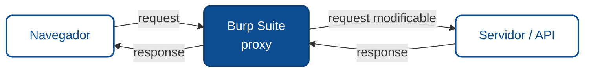

# Burp Suite paso a paso

El 80% del pentesting web pasa por un proxy de interceptación, y Burp Suite es el estándar de la industria. Dominarlo es la destreza que más rinde. Este módulo te lleva de instalarlo a usar sus herramientas centrales sobre un blanco legal.

:::info Ver también
Este módulo es la práctica concreta de la herramienta que aparece en toda la [metodología](./01-metodologia-para-encontrar-vulnerabilidades.md) y en el [proceso de intrusión](./09-hacking-etico-practica-de-intrusion.md). Todo el trabajo de aquí se hace sobre [OWASP Juice Shop](https://owasp.org/www-project-juice-shop/), un blanco autorizado por diseño.
:::

## Qué es y dónde se ubica

Burp Suite se sienta **entre el navegador y el servidor**: todo el tráfico pasa por él, y vos podés verlo, pausarlo, modificarlo y repetirlo. Eso te da control total sobre cada request, más allá de lo que el frontend te deja hacer.

Hay una edición **Community gratuita** (suficiente para aprender: Proxy, Repeater, Decoder, Comparer) y una **Professional** de paga (agrega el Scanner automático y el Intruder sin límite de velocidad). [OWASP ZAP](https://www.zaproxy.org/) es la alternativa totalmente gratuita y open source, con las mismas ideas.

## Paso 1: Configurar el proxy

Para que el tráfico pase por Burp hay dos ajustes:

1. **Apuntar el navegador a Burp.** Burp escucha por defecto en `127.0.0.1:8080`. Configurás el navegador (o usás el navegador incorporado de Burp, que ya viene listo) para usar ese proxy. El navegador incorporado es la vía más simple para empezar.
2. **Instalar el certificado CA de Burp.** Como el tráfico HTTPS va cifrado, Burp usa su propio certificado para poder leerlo. Se instala una vez desde `http://burp` con el navegador ya apuntando al proxy. Sin esto, los sitios HTTPS darán error de certificado.

Con eso, navegá Juice Shop en `localhost:3000`: cada request aparece en Burp.

## Paso 2: Proxy e HTTP history

La pestaña **Proxy** es el corazón. Tiene dos modos:

- **Intercept:** cuando está activo, cada request se pausa y te espera. Podés editarlo antes de dejarlo pasar. Útil para modificar algo puntual; molesto si lo dejás siempre encendido (apagalo para navegar normal).
- **HTTP history:** el registro de todo lo que pasó por el proxy, aunque no interceptaras. Acá ves cada request real que hizo la app, incluidos los que el frontend hace en segundo plano. Es tu mapa de la superficie de ataque en vivo.

## Paso 3: Target y el alcance (scope)

La pestaña **Target** arma el **sitemap**: el árbol de todo lo que Burp vio del objetivo. Lo primero que conviene hacer es definir el **scope**: agregar tu blanco (Juice Shop) al alcance y filtrar para ver solo eso. Así el ruido de otros dominios (analytics, CDNs) no te distrae, y evitás por accidente mandar tráfico a donde no debés. El scope es también tu recordatorio técnico de los límites de la autorización.

## Paso 4: Repeater — la herramienta que más vas a usar

El **Repeater** te deja tomar un request, modificarlo y reenviarlo cuantas veces quieras, viendo la respuesta cada vez. Es donde se prueban las hipótesis.

El flujo típico: en el HTTP history, clic derecho sobre un request interesante → "Send to Repeater". Ahí cambiás un parámetro (un `id`, un campo, una cabecera) y mandás. Comparás la respuesta con la original. Así confirmás un IDOR (cambiando el `id`), una inyección (metiendo una comilla), o una falla de autorización (quitando el token).

## Paso 5: Intruder — automatizar variaciones

El **Intruder** repite un request muchas veces sustituyendo una parte por valores de una lista. Sirve para probar muchas variantes rápido: una lista de identificadores para barrer un IDOR, un diccionario de contraseñas contra un login (en tu lab), o valores para descubrir parámetros. Marcás la posición a variar, cargás la lista de valores (*payloads*), y Burp lanza todas las combinaciones y te muestra las respuestas para que detectes la distinta. En la edición Community va a velocidad reducida, suficiente para aprender.

## Paso 6: Decoder y Comparer

- **Decoder:** codifica y decodifica datos (Base64, URL, HTML, hex). Útil para leer un token, decodificar un valor Base64 de una cabecera, o preparar un payload en el formato correcto.
- **Comparer:** compara dos respuestas y resalta las diferencias. Ayuda a ver qué cambió entre un request normal y uno manipulado, cuando la diferencia no salta a la vista.

## Paso 7: Scanner y extensiones (Professional)

- El **Scanner** (solo Pro) recorre el objetivo y detecta vulnerabilidades automáticamente. Acelera mucho, pero no reemplaza la revisión manual de la lógica de negocio.
- El **BApp Store** ofrece extensiones que agregan capacidades. Se mencionan para que sepas que existen; no las necesitás para empezar.

## Flujo completo en Juice Shop

Poniéndolo junto, una sesión real se ve así:

1. Levantás Juice Shop y apuntás el navegador a Burp con el CA instalado.
2. Navegás la tienda con Intercept apagado; el HTTP history se llena con la superficie real.
3. Agregás Juice Shop al scope y filtrás el sitemap.
4. Mandás el request de login al Repeater y probás `' OR 1=1;--` en el email; ves la respuesta.
5. Mandás el request de tu carrito al Repeater y cambiás el `id` para probar un IDOR.
6. Usás el Intruder para barrer una lista de identificadores y detectar cuáles devuelven datos ajenos.
7. Documentás cada request y respuesta como evidencia para el reporte.

## Buenas prácticas

- **Apagá Intercept** cuando no lo estés usando; si no, cada clic en la web se te congela.
- **Definí el scope siempre**, para no mandar tráfico fuera de lo autorizado.
- **Guardá el proyecto** para conservar el sitemap y el history de la sesión.
- **Repeater antes que Intruder:** confirmá una hipótesis manualmente antes de automatizarla.

## Resumen para agentes

- **Objetivo:** operar Burp Suite para interceptar, modificar, repetir y automatizar requests sobre un blanco autorizado.
- **Entradas comunes:** blanco de práctica, Burp con proxy y CA configurados, alcance definido.
- **Controles clave:** proxy e history, scope, Repeater, Intruder, Decoder/Comparer, Scanner (Pro).
- **Salidas esperadas:** requests manipulados con sus respuestas como evidencia de hallazgos.
- **Errores frecuentes:** dejar Intercept siempre activo, no definir scope, saltar directo al Intruder sin confirmar en Repeater, olvidar instalar el CA.

## Glosario

**Proxy de interceptación** *(Intercepting proxy)* — herramienta entre navegador y servidor para ver y modificar el tráfico.

**Intercept** — modo de Burp que pausa cada request para editarlo.

**HTTP history** — registro de todo el tráfico que pasó por el proxy.

**Scope** — conjunto de objetivos dentro del alcance autorizado.

**Repeater** — herramienta para modificar y reenviar un request repetidamente.

**Intruder** — herramienta para automatizar un request con listas de valores.

**Payload** — el valor que se inyecta en una posición durante una prueba.

**Certificado CA** *(CA certificate)* — certificado de Burp que permite leer tráfico HTTPS.

:::info Referencias primarias
- [PortSwigger — Burp Suite documentation](https://portswigger.net/burp/documentation) — guía oficial.
- [PortSwigger Web Security Academy](https://portswigger.net/web-security) — labs para practicar con Burp.
- [OWASP ZAP](https://www.zaproxy.org/) — alternativa open source.
- [OWASP Juice Shop](https://owasp.org/www-project-juice-shop/) — blanco de práctica.
:::

---

### Bloque estructurado para agentes

**Objetivo:** usar Burp Suite en sus herramientas centrales sobre un blanco autorizado.

**Entradas:**
- Blanco de práctica legal (Juice Shop u otro).
- Burp con proxy y certificado CA instalados.
- Alcance definido en el scope.

**Pasos:**
1. Configurar el proxy y el CA; navegar el blanco para poblar el HTTP history.
2. Definir el scope y filtrar el sitemap al objetivo.
3. Enviar requests al Repeater para probar hipótesis (IDOR, inyección, autorización).
4. Usar el Intruder para automatizar variaciones con listas de payloads.
5. Apoyarse en Decoder y Comparer para datos codificados y diferencias.
6. Documentar requests y respuestas como evidencia.

**Salidas:**
- Evidencia reproducible de cada hallazgo.
- Sitemap y proyecto de la sesión guardados.

**Errores comunes:**
- Dejar Intercept activo permanentemente.
- No definir scope y salir del alcance.
- Automatizar en Intruder sin confirmar antes en Repeater.

**Referencias cruzadas:**
- [1.6.9 Hacking ético: práctica de intrusión](./09-hacking-etico-practica-de-intrusion.md)
- [1.6.1 Metodología para encontrar vulnerabilidades](./01-metodologia-para-encontrar-vulnerabilidades.md)

---

<AuthorCredit />
