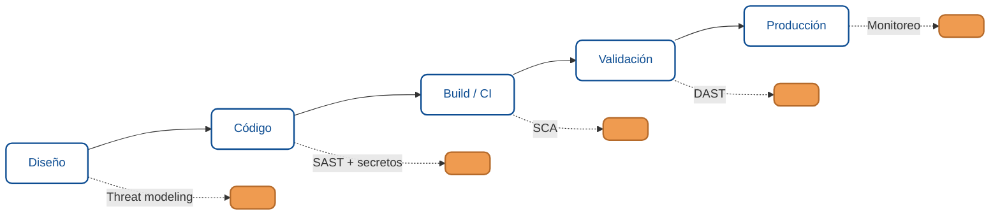

# Seguridad en el ciclo de vida (DevSecOps)

Encontrar y corregir vulnerabilidades una por una no escala. Un equipo maduro no persigue fallos al final: los previene a lo largo de todo el desarrollo. Este módulo cierra el curso integrando todo lo anterior en el ciclo de vida del software, la práctica que se conoce como **DevSecOps**.

:::info Ver también
Este módulo conecta el curso de seguridad con lo que ya viste sobre calidad y pipeline: [Integración de SonarQube en el ciclo DevOps](../fundamentos-sonarqube/04-ciclo-devops.md) y [SAST y SCA en la fase de validación](../fundamentos-sonarqube/05-sast-y-sca-en-validacion.md). Aquí lo enmarcamos como una estrategia completa.
:::

## La idea central: mover la seguridad a la izquierda

En el modelo viejo, la seguridad era una revisión al final, justo antes de salir a producción. Encontrar un fallo ahí es caro: hay que rehacer código ya terminado, y a veces se sale con el riesgo por presión de fecha.

**Shift-left** (mover a la izquierda) es la idea de meter la seguridad en cada etapa del desarrollo, desde el diseño. Cuanto antes se detecta un problema, más barato es corregirlo. La seguridad deja de ser una compuerta final y pasa a ser una responsabilidad continua de todo el equipo.

## Dónde entra cada control

Cada etapa del ciclo tiene su control de seguridad. Estos son los que ya conocés, ubicados en su momento:

| Etapa | Control | Qué previene |
|---|---|---|
| Diseño | Modelado de amenazas | Fallas de arquitectura antes de escribir código |
| Código | SAST + escaneo de secretos | Patrones inseguros y credenciales filtradas |
| Build (CI) | SCA | Dependencias vulnerables |
| Validación | DAST + revisión manual | Fallas visibles solo en ejecución |
| Producción | Monitoreo y logging | Ataques en curso y anomalías |

Ninguno cubre todo solo; juntos forman la defensa en profundidad del ciclo.

## Modelado de amenazas, en simple

El **modelado de amenazas** es pensar, antes de construir, qué puede salir mal. No requiere herramientas: una conversación estructurada del equipo sobre una función nueva alcanza para empezar. Un método liviano es preguntarse, por cada componente:

- ¿Qué datos maneja y quién debería acceder?
- ¿Por dónde entran datos que no controlamos?
- ¿Qué pasa si un atacante manipula cada entrada?
- ¿Qué es lo peor que podría lograr, y cómo lo frenamos?

Marcos como **STRIDE** dan una lista de categorías de amenaza (suplantación, manipulación, repudio, fuga de información, denegación de servicio, elevación de privilegios) para no olvidarse de ninguna. Hacer esto en el diseño evita construir sobre una base insegura.

## Seguridad en el pipeline

El pipeline de CI/CD es donde el shift-left se vuelve automático y repetible. La meta: que cada cambio pase por los controles sin que nadie tenga que acordarse.

- **SAST** en cada pull request, que marque patrones inseguros en el código nuevo.
- **Escaneo de secretos** que impida que una clave llegue al repositorio.
- **SCA** que revise dependencias, incluidas las transitivas.
- **DAST** contra un entorno de prueba, para lo que solo se ve en ejecución.
- **Quality gate** que bloquee el merge o el despliegue ante hallazgos críticos nuevos, con excepciones documentadas cuando corresponda.

La clave operativa es el balance: umbrales que atrapen lo grave sin ahogar al equipo en ruido. Un pipeline que falla por todo se termina ignorando.

## Cultura: la seguridad es de todo el equipo

La herramienta más potente no es un escáner, es la cultura. En los equipos maduros:

- **Todos son responsables** de la seguridad, no solo un área aparte.
- Hay **security champions**: personas del equipo de desarrollo con foco extra en seguridad, que difunden buenas prácticas y hacen de puente.
- Los hallazgos se tratan **sin culpa**: el objetivo es corregir y aprender, no buscar culpables, porque eso hace que la gente esconda los problemas.
- La seguridad se **capacita continuamente**, porque las amenazas cambian.

## Gestión continua de vulnerabilidades

La seguridad no termina en el despliegue. Un proceso vivo incluye:

- **Monitoreo** en producción: logs, alertas de comportamiento anómalo.
- **Reescaneo periódico:** una dependencia que hoy es segura puede tener un CVE mañana.
- **Un canal de reporte** (incluido, si aplica, un programa de divulgación o bug bounty) y un proceso claro para triar y corregir lo que entra.
- **Métricas:** tiempo medio de corrección, densidad de hallazgos por release, tendencia. Lo que se mide, mejora.

## Checklist de release seguro

Antes de sacar una versión a producción:

- Modelado de amenazas hecho para las funciones nuevas de riesgo.
- SAST y SCA en verde (o excepciones documentadas con dueño y fecha).
- Sin secretos en el repositorio ni en la imagen.
- Cabeceras de seguridad y CORS configurados; HTTPS forzado.
- Autenticación y autorización verificadas en los endpoints nuevos.
- Errores sin filtrar información sensible.
- Tests de regresión de las vulnerabilidades corregidas.
- Monitoreo y logging activos para lo nuevo.

## Cierre del curso

Con este módulo cerrás el ciclo completo: aprendiste a **encontrar** vulnerabilidades (metodología y categorías 1.6.1 a 1.6.7), a **corregirlas** de raíz y priorizarlas (1.6.8), a **probar** como lo haría un atacante de forma ética (1.6.9 y 1.6.10), y ahora a **prevenirlas** integrando la seguridad en todo el desarrollo (1.6.11). Ese es el trabajo real de seguridad: no un evento, un ciclo.

## Resumen para agentes

- **Objetivo:** integrar la seguridad en todas las etapas del ciclo de vida del software.
- **Entradas comunes:** diseño de funciones, código, pipeline de CI/CD, entorno de producción.
- **Controles clave:** modelado de amenazas, SAST, escaneo de secretos, SCA, DAST, quality gate, monitoreo, cultura y champions.
- **Salidas esperadas:** seguridad automatizada por etapa, releases verificados, gestión continua de vulnerabilidades.
- **Errores frecuentes:** dejar la seguridad para el final, tratarla como tarea de un área aislada, pipelines ruidosos que se ignoran, no reescanear dependencias tras el despliegue.

## Glosario

**DevSecOps** — integración de la seguridad en las prácticas de desarrollo y operaciones.

**Shift-left** — mover los controles de seguridad a etapas tempranas del ciclo.

**Modelado de amenazas** *(Threat modeling)* — analizar en el diseño qué puede salir mal y cómo prevenirlo.

**STRIDE** — marco de categorías de amenaza para el modelado.

**Security champion** — integrante del equipo de desarrollo con foco extra en seguridad.

**Quality gate** — criterio automático que bloquea el avance si no se cumplen umbrales.

**Gestión de vulnerabilidades** *(Vulnerability management)* — proceso continuo de detectar, triar, corregir y monitorear.

:::info Referencias primarias
- [OWASP DevSecOps Guideline](https://owasp.org/www-project-devsecops-guideline/)
- [OWASP SAMM](https://owaspsamm.org/) — modelo de madurez de seguridad de software.
- [OWASP Threat Modeling](https://owasp.org/www-community/Threat_Modeling)
- [NIST SSDF](https://csrc.nist.gov/Projects/ssdf) — prácticas seguras en el ciclo de desarrollo.
:::

---

### Bloque estructurado para agentes

**Objetivo:** integrar la seguridad en cada etapa del ciclo de vida del software.

**Entradas:**
- Diseño de funciones nuevas.
- Repositorio y pipeline de CI/CD.
- Entorno de producción con monitoreo.

**Pasos:**
1. Hacer modelado de amenazas en el diseño de funciones de riesgo.
2. Ejecutar SAST y escaneo de secretos sobre el código nuevo.
3. Ejecutar SCA sobre dependencias en el build.
4. Ejecutar DAST y revisión manual en validación.
5. Aplicar un quality gate con umbrales balanceados.
6. Monitorear en producción y reescanear dependencias periódicamente.

**Salidas:**
- Controles de seguridad automatizados por etapa.
- Releases verificados contra el checklist seguro.
- Métricas de gestión de vulnerabilidades.

**Errores comunes:**
- Dejar la seguridad para el final del ciclo.
- Aislarla en un área en vez de compartirla en el equipo.
- Pipelines tan ruidosos que se terminan ignorando.

**Referencias cruzadas:**
- [1.3.4 Integración de SonarQube en el ciclo DevOps](../fundamentos-sonarqube/04-ciclo-devops.md)
- [1.6.8 Del hallazgo a la corrección](./08-del-hallazgo-a-la-correccion.md)

---

<AuthorCredit />
